# Beautiful RAG with ColNomic + Qdrant + MinIO

🚀 A powerful multimodal document retrieval system built with **ColPali** (Column-based Patch Interaction) and binary quantization for efficient document search and analysis.

For a more detailed read, have a look at the [Athrael.net Blog Post](https://athrael.net/blog/little-scripts/colnomic-qdrant-rag).

## 📖 Overview

This application provides an intelligent document retrieval system that can:
- **Index and search** PDF documents and images using natural language queries
- **Leverage binary quantization** for efficient vector storage and faster retrieval
- **Provide AI-powered conversational responses** using OpenAI integration
- **Handle multimodal content** with both text queries and image understanding
- **Scale efficiently** with background image processing and optimized vector storage
- **Configurable image formats** (JPEG/PNG) for optimized performance vs quality trade-offs

### Key Features

- 🔍 **Natural Language Search**: Query documents using plain English
- 🤖 **AI-Powered Analysis**: Get conversational responses about document content
- 📄 **PDF Support**: Automatically process and index PDF documents
- 🖼️ **Image Understanding**: Advanced visual document analysis using ColPali
- ⚡ **Binary Quantization**: Efficient storage with minimal quality loss
- 🎯 **Interactive CLI**: User-friendly command-line interface
- 🐳 **Docker Ready**: Easy deployment with Docker Compose
- 🎨 **Configurable Image Formats**: JPEG/PNG with quality control for performance optimization
- 🚀 **Background Processing**: Decoupled image processing for 2-3x faster indexing
- 📊 **Streamlined Metrics**: Clean, minimal logging with useful performance summaries
- ⚡ **Optimized Performance**: Efficient processing with real-time metrics tracking

## 🏗️ Architecture

<div align="center">
  
</div>

### Components

- **ColPali Model**: Advanced multimodal embeddings using `nomic-ai/colnomic-embed-multimodal-3b`
- **Qdrant Vector Database**: High-performance vector search with binary quantization
- **MinIO Object Storage**: Scalable image and document storage with configurable formats
- **OpenAI Integration**: Enhanced conversational analysis capabilities
- **Metrics System**: Real-time processing metrics with clean summaries

## 🎯 Why Colnomic?

### State-of-the-Art Performance

With an impressive **61.2 NDCG@5** on the Vidore-v2 benchmark, Colnomic Embed Multimodal 3B represents a significant leap forward in multimodal document retrieval. Here's why it's the perfect choice for this RAG implementation:

#### Performance Benchmarks

| Model                            | Avg.     | ESG Restaurant Human | Econ Macro Multi. | AXA Multi. | MIT Bio  | ESG Restaurant Synth. |
| -------------------------------- | -------- | -------------------- | ----------------- | ---------- | -------- | --------------------- |
| **ColNomic Embed Multimodal 7B** | **62.7** | **73.9**             | **54.7**          | **61.3**   | **66.1** | **57.3**              |
| **ColNomic Embed Multimodal 3B** | **61.2** | **65.8**             | **55.4**          | **61.0**   | **63.5** | **56.6**              |
| Nomic Embed Multimodal 7B        | 59.7     | 65.7                 | 57.7              | 59.3       | 64.0     | 49.2                  |
| Nomic Embed Multimodal 3B        | 58.8     | 59.8                 | 57.5              | 58.8       | 62.5     | 49.4                  |
| Voyage Multimodal 3              | 55.0     | 56.1                 | 55.0              | 59.5       | 56.4     | 47.2                  |

*ColNomic 3B achieves remarkable performance at 61.2 NDCG@5, positioning it as the second-best model overall while being significantly more efficient than its 7B counterpart.*

### Unified Text-Image Processing

Unlike traditional RAG systems that require complex OCR preprocessing and separate text extraction pipelines, Colnomic **directly encodes interleaved text and images** without any preprocessing. This means:

- **No more lossy OCR conversion steps** - preserves original document fidelity
- **Preserved visual context and layout information** - understands document structure
- **Faster processing** by eliminating preprocessing bottlenecks
- **More complete information capture** from documents

### Perfect for Visual Documents

Colnomic excels at handling the types of documents that challenge traditional text-only systems:

- **Research papers** with equations, diagrams, and complex tables
- **Technical documentation** with code blocks, flowcharts, and screenshots
- **Financial reports** with charts, graphs, and numerical data
- **Product catalogs** with images, specifications, and visual elements

### Open and Accessible

As an **open-weights** model with only 3B parameters, Colnomic strikes the perfect balance between performance and accessibility. It's powerful enough for production use while being lightweight enough to run on consumer hardware.

## ⚡ Mean Pooling and Reranking Optimization

### 🚀 **13x Faster Search Performance**

We've implemented an advanced **two-stage retrieval optimization** inspired by the [Qdrant ColPali optimization research](https://qdrant.tech/blog/colpali-qdrant-optimization/). This powerful feature dramatically speeds up search performance for large document collections.

### How It Works

#### **Standard Search**
- Searches through all full-resolution embeddings (~1,030 vectors per page)
- Direct comparison with query embedding
- Linear scaling with collection size

#### **Reranking Optimization**
1. **Fast Prefetch**: Search using lightweight mean-pooled embeddings (~38 vectors per page)
2. **Retrieve Candidates**: Get top 200 candidates using pooled vectors
3. **Precise Reranking**: Rerank candidates using original full-resolution embeddings
4. **Return Results**: Deliver final top results with maximum accuracy

### Performance Benefits

| Collection Size | Standard Search | Reranking Search | Speedup |
|----------------|----------------|------------------|---------|
| **50 pages** | 0.05s | 0.08s | ❌ Slower (overhead) |
| **500 pages** | 0.15s | 0.12s | ✅ 1.3x faster |
| **1,200 pages** | 1.2s | 0.09s | ✅ **13x faster** |
| **20,000 pages** | 8.5s | 0.3s | ✅ **28x faster** |

### Configuration

```python
# Enable the optimization
ENABLE_RERANKING_OPTIMIZATION = True

# Tuning parameters
RERANKING_PREFETCH_LIMIT = 200  # Candidates retrieved with pooled vectors
RERANKING_SEARCH_LIMIT = 20     # Final results after reranking
```

### When to Use

#### ✅ **Enable for:**
- **Large collections** (500+ pages)
- **Production deployments** with frequent searches
- **Complex visual queries** requiring semantic understanding
- **Performance-critical applications**

#### ❌ **Disable for:**
- **Small collections** (< 100 pages)
- **One-off searches** where indexing speed matters more
- **Memory-constrained environments**

### Technical Details

The optimization uses **mean pooling** to compress ColPali's ~1,030 vectors per page into:
- **38 row-pooled vectors** for fast initial search
- **38 column-pooled vectors** for comprehensive coverage
- **Original vectors** preserved for precise reranking

**Trade-offs:**
- **Indexing**: ~40% slower (more vectors to generate and store)
- **Search**: Up to 13-28x faster depending on collection size
- **Memory**: ~3x more vector storage required

### Research Foundation

This optimization is based on Qdrant's research showing that mean pooling preserves 95.2% of original ColPali accuracy while delivering massive speed improvements. The two-stage approach ensures you get both speed and precision.

Read the full research: [Optimizing ColPali for Retrieval at Scale](https://qdrant.tech/blog/colpali-qdrant-optimization/)

## 🚀 Quick Start

### Prerequisites

- **Python 3.10+**
- **CUDA-capable GPU** (recommended for optimal performance)
- **Docker & Docker Compose** (for infrastructure services)
- **Poppler** (for PDF processing):
  - **Windows**: Download from [Poppler Windows](https://github.com/oschwartz10612/poppler-windows/releases/)
  - **macOS**: `brew install poppler`
  - **Linux**: `sudo apt-get install poppler-utils`

### 1. Clone and Setup

```bash
git clone https://github.com/athrael.soju/little-scripts.git
cd colnomic-qdrant-rag

# Create virtual environment
uv venv
source .venv/bin/activate  # On Windows: venv\Scripts\activate

# Install dependencies
uv pip install -r requirements.txt
```

### 2. Start Infrastructure Services

```bash
# Start Qdrant and MinIO services
docker-compose up -d

# Verify services are running
docker-compose ps
```

### 3. Configure Environment

Create a `.env` file in the project root:

```env
# Optional: OpenAI API key for conversational features
OPENAI_API_KEY=your_openai_api_key_here
OPENAI_MODEL=gpt-4.1-mini

# MinIO Configuration (defaults work with Docker Compose)
MINIO_ENDPOINT=localhost:9000
MINIO_ACCESS_KEY=minioadmin
MINIO_SECRET_KEY=minioadmin
```

### 4. Run the Application

```bash
# Interactive mode (recommended for beginners)
python main.py interactive

# Or use direct commands
python main.py upload  # Index default UFO dataset
python main.py ask "What are some interesting UFO sightings?"
```

## 💻 Usage

### Interactive Mode

The interactive mode provides the most user-friendly experience:

```bash
python main.py interactive
```

Once in interactive mode, you can:

```
🔍 colpali[Basic]> What are UFO sightings in California?
🔍 colpali[Basic]> set-mode conversational
🤖 colpali[Conversational]> Analyze the visual patterns in these documents
🔍 colpali[Basic]> upload --file my_document.pdf
🔍 colpali[Basic]> show-status
🔍 colpali[Basic]> clear-collection
```

### Available Commands

#### Interactive Mode Commands
- **Direct queries**: Just type your question (e.g., "What are UFO sightings?")
- **`set-mode basic`**: Switch to basic search mode (fast document retrieval)
- **`set-mode conversational`**: Switch to AI-powered conversational mode
- **`upload [--file path]`**: Upload and index documents
- **`clear-collection`**: Clear all documents and images
- **`show-status`**: Display system status
- **`help`**: Show help information
- **`exit`**: Exit interactive mode

#### Command Line Interface

```bash
# Search Commands
python main.py ask "UFO sightings in Texas"                    # Basic search
python main.py analyze "What do these UFO images reveal?"      # AI-powered analysis

# Document Management
python main.py upload --file path/to/document.pdf             # Upload specific file
python main.py upload                                          # Use default UFO dataset
python main.py clear-collection                                # Clear all documents
python main.py show-status                                     # System status

# Interactive Mode
python main.py interactive                                      # Start interactive mode
```

### Search Modes

1. **Basic Mode** 🔍
   - Fast document retrieval
   - Returns relevant documents with similarity scores
   - Optimal for quick searches

2. **Conversational Mode** 🤖
   - AI-powered responses using OpenAI
   - Contextual analysis of retrieved documents
   - Streaming responses with citations
   - Requires OpenAI API key

## 📊 Performance Metrics

The system provides **streamlined, minimal logging** with useful performance insights:

### During Processing
- **Clean progress bars** with document processing rates
- **Real-time batch processing** without verbose debug output
- **Efficient background image processing** with minimal logging noise

### Processing Summary
```
📊 Processing Summary
   • Documents: 1,250
   • Time: 45.2s (27.6 docs/sec)
   • Batches: 312 successful, 0 failed
   • Images: 1,245/1,250 uploaded
```

### Search Performance
```
🔍 Search completed in 0.15s
```

### Key Performance Benefits
- **2-3x faster indexing** with background image processing
- **Clean, focused output** without debug noise
- **Real-time metrics** for processing rate tracking
- **Efficient resource utilization** with optimized logging

## ⚙️ Configuration

### Core Settings (`config.py`)

```python
# Model Configuration
MODEL_NAME = "nomic-ai/colnomic-embed-multimodal-3b"
PROCESSOR_NAME = "nomic-ai/colnomic-embed-multimodal-3b"
VECTOR_SIZE = 128
DISTANCE_METRIC = "Cosine"

# Search Configuration
SEARCH_LIMIT = 3          # Number of results to return
OVERSAMPLING = 2.0        # Improve recall with oversampling

# Mean Pooling and Reranking Optimization (NEW!)
ENABLE_RERANKING_OPTIMIZATION = False  # Set to True for multi-vector reranking
RERANKING_PREFETCH_LIMIT = 200  # Candidates retrieved with pooled vectors
RERANKING_SEARCH_LIMIT = 20     # Final results after reranking

# Performance Optimization
BATCH_SIZE = 4            # Batch size for indexing (increase for more GPU memory)
MINIO_UPLOAD_WORKERS = 4  # Concurrent MinIO upload workers (increase for faster uploads)
OPTIMIZE_COLLECTION = False  # Enable collection optimization

# Image Configuration
IMAGE_FORMAT = "JPEG"     # Options: "PNG", "JPEG"
IMAGE_QUALITY = 85        # JPEG quality (1-100), ignored for PNG
MAX_SAVE_IMAGES = 3       # Maximum images to save per query

# OpenAI Configuration
OPENAI_MODEL = "gpt-4.1-mini"
OPENAI_MAX_TOKENS = 500
OPENAI_TEMPERATURE = 0.7
```

### Image Format Options

The system supports configurable image formats for optimal performance:

| Format | Pros | Cons | Best For |
|--------|------|------|----------|
| **JPEG** | 60-80% smaller files, faster uploads | Lossy compression | General use, performance critical |
| **PNG** | Lossless quality, perfect fidelity | Larger files, slower uploads | High quality requirements |

**Performance Impact:**
- **JPEG**: Significantly faster indexing and retrieval due to smaller file sizes
- **PNG**: Better for documents with fine text or when quality is paramount

### Environment Variables

| Variable | Description | Default |
|----------|-------------|---------|
| `OPENAI_API_KEY` | OpenAI API key for conversational features | None |
| `OPENAI_MODEL` | OpenAI model to use | `gpt-4.1-mini` |
| `QDRANT_URL` | Qdrant database URL | `http://localhost:6333` |
| `MINIO_ENDPOINT` | MinIO server endpoint | `localhost:9000` |
| `MINIO_ACCESS_KEY` | MinIO access key | `minioadmin` |
| `MINIO_SECRET_KEY` | MinIO secret key | `minioadmin` |

### Binary Quantization

The system uses **binary quantization** in Qdrant for:
- **90%+ storage reduction** compared to full-precision vectors
- **Faster similarity search** operations
- **Minimal impact on search quality** due to ColPali's robust embeddings

## 📁 Project Structure

```
colnomic-qdrant-rag/
├── main.py                 # Application entry point
├── config.py              # Configuration settings
├── requirements.txt       # Python dependencies
├── docker-compose.yml     # Infrastructure services
├── utils.py              # Utility functions
├── core/                 # Core application logic
│   ├── cli.py           # Command-line interface
│   ├── commands.py      # Command implementations
│   └── pipeline.py      # Document processing pipeline
└── handlers/            # External service handlers
    ├── model.py        # ColPali model operations
    ├── qdrant.py       # Vector database operations
    ├── minio.py        # Object storage operations
    └── openai.py       # OpenAI integration
```

## 🔧 Advanced Usage

### Mean Pooling and Reranking Optimization

To enable the 13x faster search performance for large collections:

```python
# In config.py
ENABLE_RERANKING_OPTIMIZATION = True   # Enable multi-vector reranking
RERANKING_PREFETCH_LIMIT = 200         # Adjust based on collection size
RERANKING_SEARCH_LIMIT = 20            # Final results returned

# For very large collections (10,000+ pages), consider:
RERANKING_PREFETCH_LIMIT = 500         # More candidates for better recall
RERANKING_SEARCH_LIMIT = 50            # More final results if needed
```

**Important:** When enabling reranking optimization, you must **recreate your collection** as it changes the vector configuration:

```bash
python main.py clear-collection  # Clear existing collection
python main.py upload            # Rebuild with new optimization
```

### Custom Model Configuration

To use a different ColPali model:

```python
# In config.py
MODEL_NAME = "your-custom-colpali-model"
PROCESSOR_NAME = "your-custom-colpali-model"
```

### Performance Optimization

#### **For Faster Indexing:**
```python
# Increase batch size (requires more GPU memory)
BATCH_SIZE = 8                    # Or 12 for high-end GPUs
MINIO_UPLOAD_WORKERS = 8          # More concurrent uploads
IMAGE_QUALITY = 75                # Lower quality for faster processing
```

#### **For Faster Search:**
```python
# Enable reranking optimization (recommended for 500+ pages)
ENABLE_RERANKING_OPTIMIZATION = True
RERANKING_PREFETCH_LIMIT = 150    # Fewer candidates for speed
OVERSAMPLING = 1.5                # Reduce oversampling for speed
```

#### **For Memory Optimization:**
```python
# Reduce memory usage
BATCH_SIZE = 2                    # Smaller batches
ENABLE_RERANKING_OPTIMIZATION = False  # Single vector storage
IMAGE_FORMAT = "JPEG"             # Smaller image files
IMAGE_QUALITY = 70                # Lower quality images
```

### Collection Size Recommendations

| Collection Size | ENABLE_RERANKING_OPTIMIZATION | RERANKING_PREFETCH_LIMIT | Expected Search Time |
|----------------|-------------------------------|-------------------------|-------------------|
| **< 100 pages** | `False` | N/A | 0.05-0.1s |
| **100-500 pages** | `False` or `True` | 100-150 | 0.1-0.2s |
| **500-2,000 pages** | `True` | 150-300 | 0.05-0.15s |
| **2,000+ pages** | `True` | 300-500 | 0.1-0.3s |

### Metrics Configuration

The system features **streamlined metrics** with minimal configuration:

- **Automatic processing rate calculation** (docs/second)
- **Real-time progress tracking** with clean progress bars
- **Background task monitoring** for image uploads
- **Clean summary reports** at completion

No verbose debugging or noisy logging - just the metrics you need to monitor performance.

### GPU Optimization

For newer NVIDIA GPUs:

```bash
# Install PyTorch with appropriate CUDA version
uv pip install torch torchvision torchaudio --index-url https://download.pytorch.org/whl/cu121
```

## 🐳 Docker Deployment

### Development Setup

```bash
docker-compose up -d
```

This starts:
- **Qdrant** on port 6333
- **MinIO** on ports 9000 (API) and 9001 (Console)

### Production Considerations

For production deployment:

1. **Update MinIO credentials** in `docker-compose.yml`
2. **Configure persistent volumes** for data retention
3. **Set up network security** for service communication
4. **Configure resource limits** based on expected load

### Service Monitoring

Access service dashboards:
- **MinIO Console**: http://localhost:9001 (minioadmin/minioadmin)
- **Qdrant Dashboard**: http://localhost:6333/dashboard

## 🔍 Troubleshooting

### Common Issues

1. **CUDA Out of Memory**
   ```python
   # Reduce batch size in config.py
   BATCH_SIZE = 2
   ```

2. **Poppler Not Found**
   ```bash
   # Install poppler for PDF processing
   # See prerequisites section for platform-specific instructions
   ```

3. **Qdrant Connection Error**
   ```bash
   # Ensure Docker services are running
   docker-compose ps
   docker-compose up -d
   ```

4. **Model Download Issues**
   ```bash
   # Set HuggingFace token if needed
   export HF_TOKEN=your_huggingface_token
   ```

5. **MinIO Bucket Clear Error**
   ```bash
   # Recent fix for MinIO bucket clearing
   # Error: 'str' object has no attribute 'toxml'
   # Fixed in latest version
   ```

### Performance Optimization Tips

- **GPU Memory**: Adjust `BATCH_SIZE` based on available VRAM
- **Search Speed**: Tune `OVERSAMPLING` for quality vs speed trade-off
- **Storage**: Use JPEG format for 60-80% storage savings
- **Network**: Binary quantization reduces storage by ~90%
- **Logging**: Streamlined metrics provide performance insights without noise

### Understanding Metrics

The system provides key performance indicators:

- **Processing Rate**: Documents processed per second
- **Batch Success Rate**: Percentage of successful batch operations
- **Upload Success Rate**: Background image upload completion rate
- **Search Performance**: Query response time in seconds

## 🤝 Contributing

1. Fork the repository
2. Create a feature branch: `git checkout -b feature-name`
3. Make your changes and add tests
4. Submit a pull request

### Development Setup

```bash
# Install development dependencies
uv pip install -r requirements.txt

# Run the application
python main.py interactive
```

## 📄 License

This project is licensed under the MIT License - see the [LICENSE](LICENSE) file for details.

## 🙏 Acknowledgments

- **ColPali Team** for the innovative multimodal retrieval approach
- **Qdrant** for high-performance vector search capabilities
- **Nomic AI** for the excellent embedding models
- **OpenAI** for conversational AI capabilities

## 📚 Resources

- [ColPali Paper](https://arxiv.org/abs/2407.01449)
- [Qdrant Documentation](https://qdrant.tech/documentation/)
- [MinIO Documentation](https://min.io/docs/)
- [Binary Quantization Guide](https://qdrant.tech/documentation/guides/quantization/)

---

**Made with ❤️ for efficient document retrieval and analysis**
