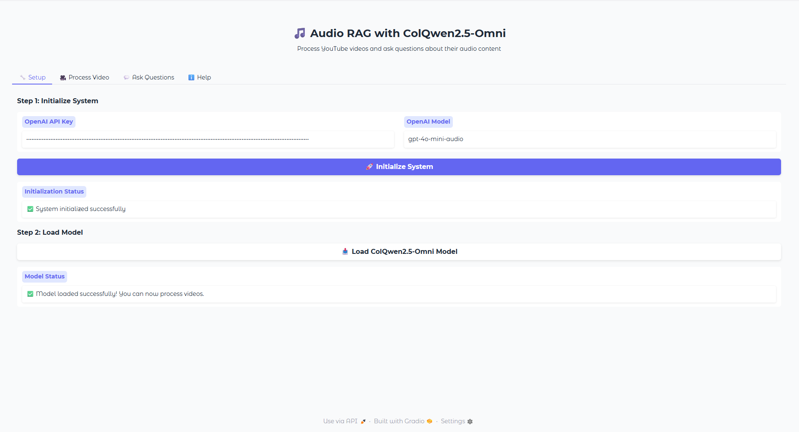
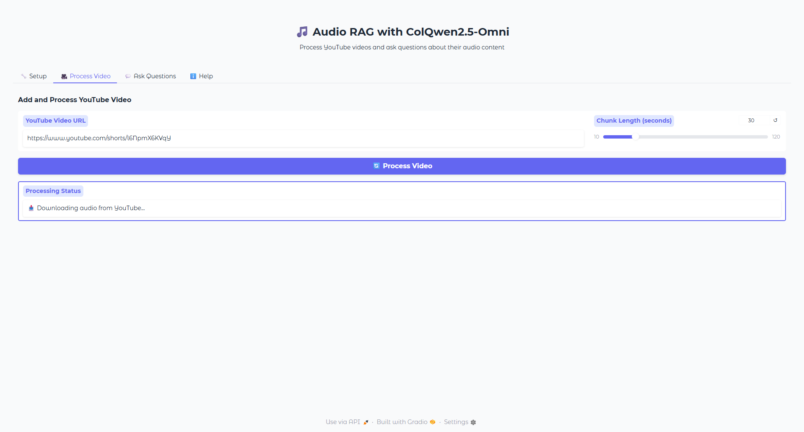
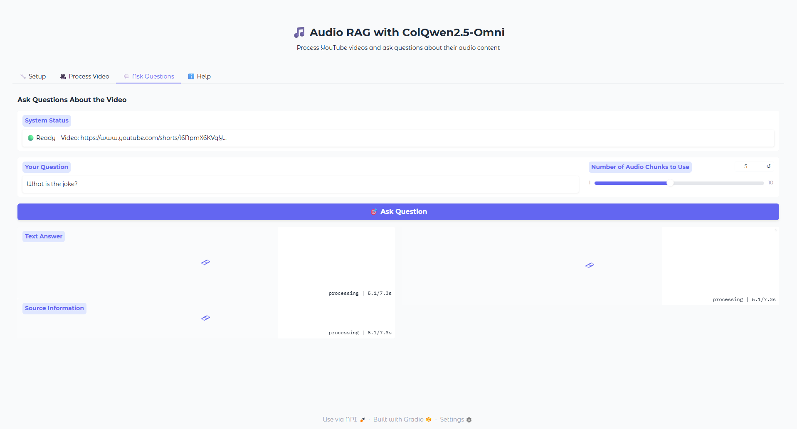
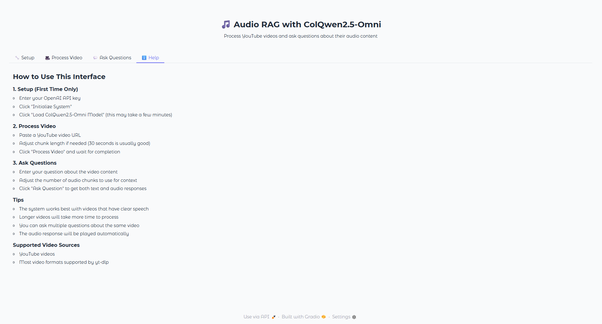

# ColQwen2.5-Omni Audio RAG System

> **⚠️ RESEARCH PURPOSES ONLY**  
> This application is intended for research and educational purposes only. It is not designed for commercial use or production environments.

## About

An Audio Retrieval-Augmented Generation (RAG) app that combines the power of ColQwen2.5-Omni multimodal model with OpenAI's GPT-4 audio capabilities. This system can process YouTube videos, extract and analyze audio content, and answer questions about the audio using both text and audio responses.

## ✨ Key Features

- 🎵 **YouTube Audio Processing**: Download and extract audio from YouTube videos automatically
- 🧠 **Advanced Audio Understanding**: Uses ColQwen2.5-Omni model for creating semantic audio embeddings
- 💬 **Intelligent Q&A**: Ask questions about audio content and get contextual answers
- 🔊 **Audio Responses**: Receive answers in both text and audio format using OpenAI's audio API
- 📊 **Chunk-based Processing**: Configurable audio chunking for optimal processing and retrieval
- 🌐 **Beautiful Web Interface**: Intuitive Gradio-based UI with multiple tabs for different functions
- ⚡ **GPU Acceleration**: Supports CUDA for faster model inference
- 🔧 **Easy Setup**: Simple launcher script and comprehensive error handling

## 🛠️ Prerequisites

### System Dependencies

**Ubuntu/Debian:**

```bash
sudo apt-get update
sudo apt-get install poppler-utils ffmpeg
```

**macOS:**

```bash
brew install poppler ffmpeg
```

**Windows:**

- Download and install [FFmpeg](https://ffmpeg.org/download.html)
- Download and install [Poppler](https://poppler.freedesktop.org/)

### Python Requirements

- Python 3.8+
- CUDA-compatible GPU (recommended for faster processing)
- OpenAI API key with audio model access

## 📦 Installation

1. **Clone the repository:**

   ```bash
   git clone https://github.com/athrael-soju/little-scripts.git
   cd little-scripts/colqwen_omni
   ```
2. **Create a virtual environment:**

   ```bash
   python -m venv .venv
   source .venv/bin/activate  # On Windows: .venv\Scripts\activate
   ```
3. **Install dependencies:**

   ```bash
   pip install -r requirements.txt
   ```
4. **Set up environment variables:**

   ```bash
   export OPENAI_API_KEY="your-openai-api-key-here"
   export OPENAI_MODEL="gpt-4o-mini-audio-preview"  # Optional, defaults to this model
   ```

## 🚀 Quick Start

### Option 1: Web Interface (Recommended)

1. **Launch the UI:**

   ```bash
   python run_ui.py
   ```
2. **Open your browser** to `http://localhost:7860`
3. **Follow the interface tabs:**

   - **Setup**: Initialize system and load model
   - **Process Video**: Add YouTube URLs and process audio
   - **Ask Questions**: Query the processed audio content
   - **Help**: View detailed usage instructions

### Option 2: Command Line Usage

```python
from app import AudioRAG

# Initialize system
rag = AudioRAG(api_key="your-openai-api-key", api_model="gpt-4o-mini-audio-preview")

# Load model
rag.load_model()

# Process YouTube video
youtube_url = "https://www.youtube.com/watch?v=example"
audio_path = rag.download_youtube_audio(youtube_url)
audio_chunks = rag.chunk_audio(audio_path, chunk_length_seconds=30)
rag.create_embeddings(audio_chunks)

# Ask questions
response = rag.answer_query("What is the main topic discussed?", k=5)
print(f"Answer: {response['answer_text']}")

# Save audio response
rag.save_audio_response(response, "answer.wav")
```

## 🎯 Usage Guide

### Step 1: Setup



1. Enter your OpenAI API key
2. Select the OpenAI model (defaults to `gpt-4o-mini-audio-preview`)
3. Click "Initialize System"
4. Click "Load ColQwen2.5-Omni Model" (may take a few minutes)

### Step 2: Process Video



1. Paste a YouTube video URL
2. Adjust chunk length (10-120 seconds, default: 30)
3. Click "Process Video"
4. Wait for processing to complete

### Step 3: Ask Questions



1. Enter your question about the video content
2. Adjust the number of audio chunks to use (1-10, default: 5)
3. Click "Ask Question"
4. Review both text and audio responses

### Step 4: Help & Tips



- The system works best with videos containing clear speech
- Longer videos take more time to process
- More audio chunks provide better context but slower responses
- You can process multiple videos by repeating Step 2

## 🔧 Configuration

### Audio Processing Parameters

- **Chunk Length**: 10-120 seconds (default: 30)

  - Shorter chunks: Better granularity, more processing time
  - Longer chunks: Faster processing, potentially less precise retrieval
- **Number of Chunks for Query**: 1-10 (default: 5)

  - More chunks: Better context, slower response
  - Fewer chunks: Faster response, potentially less comprehensive

### Model Configuration

The system uses two main models:

- **ColQwen2.5-Omni**: For audio embedding generation
- **OpenAI GPT-4 Audio**: For question answering and audio response generation

## 📁 Project Structure

```
colqwen_omni/
├── app.py              # Core AudioRAG class with processing logic
├── main.py             # Gradio UI wrapper and interface creation
├── run_ui.py           # Simple launcher script
├── requirements.txt    # Python dependencies
├── img/               # UI screenshots and documentation images
│   ├── 1.setup.png
│   ├── 2.process.png
│   ├── 3.ask-questions.png
│   └── 4.help.png
└── README.md          # This documentation
```

## 🔍 Technical Details

### Audio Processing Pipeline

1. **Download**: YouTube video downloaded using `yt-dlp`
2. **Extraction**: Audio extracted and converted to WAV format
3. **Chunking**: Audio split into configurable segments
4. **Embedding**: ColQwen2.5-Omni generates semantic embeddings
5. **Query**: User questions matched against embeddings
6. **Response**: OpenAI GPT-4 generates text and audio answers

### Model Architecture

- **ColQwen2.5-Omni**: Multimodal model for audio understanding

  - Supports audio input processing
  - Generates semantic embeddings
  - GPU acceleration with Flash Attention 2
- **OpenAI GPT-4 Audio**: Audio-enabled language model

  - Processes audio chunks directly
  - Generates contextual text responses
  - Produces natural speech audio responses

### Performance Optimizations

- **Batch Processing**: Audio chunks processed in configurable batches
- **GPU Acceleration**: CUDA support for faster inference
- **Memory Management**: Efficient handling of large audio files
- **Caching**: Embeddings stored in memory for quick retrieval

## 🐛 Troubleshooting

### Common Issues

**1. Model Loading Errors**

```bash
# Error: CUDA out of memory
# Solution: Reduce batch size or use CPU
export CUDA_VISIBLE_DEVICES=""  # Force CPU usage
```

**2. YouTube Download Failures**

```bash
# Error: Unable to download video
# Solution: Check video availability and network connection
# Try different video URLs or check yt-dlp installation
```

**3. Audio Processing Issues**

```bash
# Error: Audio conversion failed
# Solution: Install FFmpeg properly
# Check audio file format and size
```

**4. API Key Issues**

```bash
# Error: OpenAI API authentication failed
# Solution: Verify API key and model access
export OPENAI_API_KEY="your-correct-api-key"
```

### Performance Tips

- **GPU Usage**: Use CUDA-compatible GPU for faster processing
- **Chunk Length**: Optimize chunk length based on content type
- **Batch Size**: Adjust batch size based on available memory
- **Model Selection**: Choose appropriate OpenAI model for your use case

## 📊 Dependencies

### Core Libraries

- `torch`: Deep learning framework
- `transformers`: Model loading and processing
- `colpali-engine`: ColQwen2.5-Omni model support
- `openai`: OpenAI API client
- `gradio`: Web interface framework

### Audio Processing

- `moviepy`: Video and audio processing
- `pydub`: Audio manipulation
- `librosa`: Audio analysis
- `scipy`: Scientific computing

### Utilities

- `yt-dlp`: YouTube video downloading
- `numpy`: Numerical computing
- `tqdm`: Progress bars
- `requests`: HTTP requests

## 🤝 Contributing

Contributions are welcome! Please follow these steps:

1. Fork the repository
2. Create a feature branch (`git checkout -b feature/amazing-feature`)
3. Commit your changes (`git commit -m 'Add amazing feature'`)
4. Push to the branch (`git push origin feature/amazing-feature`)
5. Open a Pull Request

### Development Setup

```bash
# Clone repository
git clone https://github.com/athrael-soju/little-scripts.git
cd little-scripts/colqwen_omni

# Create development environment
python -m venv .venv
source .venv/bin/activate

# Install dependencies
pip install -r requirements.txt

# Run tests (if available)
python -m pytest tests/
```

## 📄 License

This project is part of the little-scripts monorepo and is open source. Feel free to use and modify as needed.

## 📚 References & Inspiration

This project was inspired by and built upon the following resources:

- **[ColQwen-Omni: Retrieve in every modality](https://huggingface.co/blog/manu/colqwen-omni-omnimodal-retrieval)** - Official Hugging Face blog post introducing the ColQwen-Omni model and its multimodal retrieval capabilities
- **[ColQwen-Omni Interactive Notebook](https://colab.research.google.com/drive/1YOlTWfLbiyQqfq1SlqHA2iME1R-nH4aS#scrollTo=qpsLCLWzTAnZ)** - Google Colab notebook demonstrating audio retrieval with ColQwen-Omni
- **[ColQwen-Omni Model Card](https://huggingface.co/vidore/colqwen-omni-v0.1)** - Official model documentation and usage examples

## 🙏 Acknowledgments

- [ColPali Team](https://github.com/illuin-tech/colpali) for the ColQwen2.5-Omni model
- [OpenAI](https://openai.com/) for the GPT-4 audio API
- [Gradio](https://gradio.app/) for the web interface framework
- [yt-dlp](https://github.com/yt-dlp/yt-dlp) for YouTube video downloading

## 📞 Support

For issues and questions:

1. Check the troubleshooting section above
2. Search existing issues in the repository
3. Create a new issue with detailed information
4. Include error messages, system information, and steps to reproduce

---

<div align="center">
  <p>⭐ If you find this project useful, please consider giving it a star!</p>
</div>
